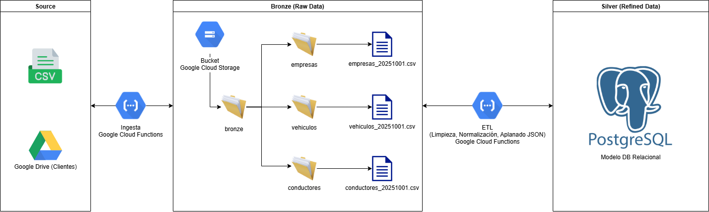
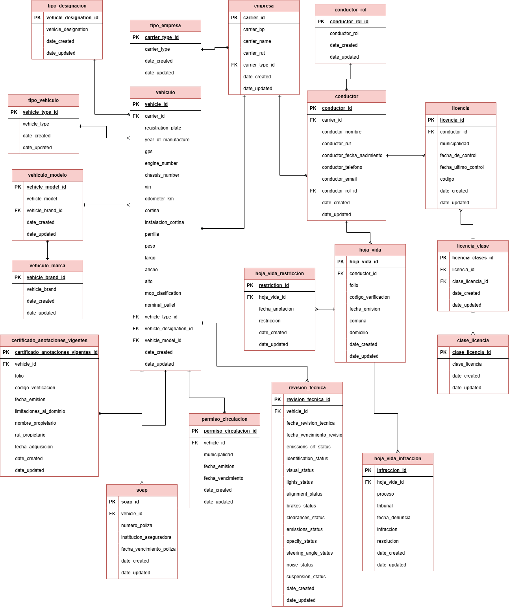

# GCP Data Lake & ETL Pipeline

This project implements a serverless data pipeline on Google Cloud Platform (GCP). It ingests CSV files from a Google Drive folder, lands them in a Google Cloud Storage (GCS) bucket (acting as a Data Lake), and then triggers an event-driven ETL function to process and load the data into a Cloud SQL (PostgreSQL) database.

## Architecture

The pipeline consists of two main serverless functions:

`Google Drive (nuevos/)` → `[Function 1: Ingesta]` → `GCS Bucket (ingesta_drive/)` → `[Function 2: ETL]` → `Cloud SQL (PostgreSQL)`

### Architecture Diagram



---

## Project Structure

- `/ingesta-drive-gcs`: A Node.js/TypeScript HTTP Cloud Function responsible for the **Ingestion** process.
- `/etl-gcs-cloudsql`: A Node.js/TypeScript Event-driven Cloud Function responsible for the **ETL** process.
- `/model.sql`: The complete DDL (Data Definition Language) for the PostgreSQL database schema (`your_db_schema`).
- `/.gitignore`: Correctly ignores `node_modules`, `build/` directories, and `.env.yaml` files.

### Database Schema (ERD)

This is the visual representation of the `model.sql` file, showing the relationships between companies, drivers, and vehicles.

## 

## Data Schema & CSV Structure

The pipeline is designed to process three types of CSV files, identified by their filenames.

**Common Format:**

- **Delimiter:** All files must be semicolon (`;`) delimited.
- **Encoding:** Files may contain a UTF-8 BOM (Byte Order Mark), which the ETL parser is configured to handle.
- **JSON Content:** Some columns contain a full, escaped JSON object as a string.

---

### 1. Companies (`*empresa*.csv`)

This file contains the master list of companies. The ETL performs an "Upsert" on the `empresa` table based on the `carrier_rut` (RUT).

**Headers:**
`"carrier_bp";"carrier_name";"carrier_tin";"carrier_type"`

**Example:**

```csv
"carrier_bp";"carrier_name";"carrier_tin";"carrier_type"
1111111;EMPRESA 1;"11111111-1";TIPO 1
2222222;EMPRESA 2;"22222222-2";TIPO 2
```

| Header         | Type     | Description                                               |
| -------------- | -------- | --------------------------------------------------------- |
| `carrier_bp`   | `string` | Business Partner ID. **Required.**                        |
| `carrier_name` | `string` | Company's full name. **Required.**                        |
| `carrier_tin`  | `string` | Company's Tax ID (RUT), e.g., "11111111-1". **Required.** |
| `carrier_type` | `string` | Company's business type (e.g., "TIPO 1"). **Required.**   |

---

### 2. Conductors (`*conductor*.csv`)

Contains driver information. The ETL performs an "Upsert" on the `conductor` table based on `national_id` (RUT). Related documents (licenses, driver records) are **historized** (new records are added, old ones are not deleted).

**Headers:**
`"driver_name";"national_id";"birth_date";"phone_number";"email";"carrier_bp";"driver_role";"hoja_de_vida_data";"licencia_frontal_data";"licencia_reverso_data"`

**Simple Fields:**
| Header | Type | Description |
| :--- | :--- | :--- |
| driver_name | string | Conductor's full name. |
| national_id | string | Primary Key. Conductor's Tax ID (RUT). Required. |
| birth_date | date | e.g., "1978-11-09". | | phone_number | string | (Optional) |
| email | string | (Optional) |
| carrier_bp | string | Foreign Key. Links to the company's carrier_bp. Required. |
| driver_role | string | Role (e.g., "ROL 1"). Required. |

**JSON Data Fields:**
| Header | Description |
| :--- | :--- |
| hoja_de_vida_data | Escaped JSON string. Contains the driver's record. The ETL parses keys: certificado (folio, fechaEmision, codigoVerificacion), persona (comuna, domicilio, restriccionesLicencia, duracionesRestringidas, infraccionesRegistradas). |
| licencia_frontal_data | Escaped JSON string. Contains front-of-license data. The ETL parses keys: clase (array of strings), municipalidad, fecha_de_control, fecha_ultimo_control. |
| licencia_reverso_data | Escaped JSON string. Contains back-of-license data. The ETL parses the codigo key. |

---

### 3. Vehicles (`*vehiculo*.csv`)

Contains vehicle information. The ETL performs an "Upsert" on the vehiculo table based on registration_plate. All related documents (technical revision, SOAP, etc.) are **historized** (new records are added, old ones are not deleted).

**Headers:** `registration_plate;carrier_bp;year_of_manufacture;gps;...[+30 more headers]`

**Main Vehicle Data:**
| Header | Type | Description |
| :--- | :--- | :--- |
| `registration_plate` | string | Primary Key. Vehicle plate (e.g., "AAAA11"). Required. |
| `carrier_bp` | string | Foreign Key. Links to the company's carrier_bp. Required. |
| `year_of_manufacture`| integer | e.g., 2025. | | gps | boolean | "true" or "false". |
| ... | ... | ...and other simple fields (vin, chassis, odometer, etc.) |
| `vehicle_make` | string | Vehicle brand (e.g., "FACCHINI"). |
| `vehicle_model` | string | Vehicle model (e.g., "MODEL 1"). |

**Technical Revision Data:**
| Header | Type | Description |
| :--- | :--- | :--- |
| `fecha_revision_tecnica` | date | Date of technical revision. |
| `fecha_vencimiento_revision_tecnica` | date | Expiration date of technical revision. |
| `emissions_crt_status` | string | Status (e.g., "Aprobada", "Rechazada"). Parsed to boolean. |
| `identification_status` | string | Status (e.g., "Aprobada"). Parsed to boolean. |
| ... (12+ other status columns) | string | Parsed from "Aprobada" / "Rechazada" to boolean. |

**JSON Data Columns:**
| Header | Description |
| :--- | :--- |
| `permiso_circulacion_data` | Escaped JSON string. The ETL parses:`municipalidad`, `fecha_emision`, `fecha_vencimiento`. |
| `certificado_anotaciones_vigentes_data` | Escaped JSON string. The ETL parses: `folio`, `codigo_verificacion`, `fecha_emision`, `limitaciones_al_dominio`, and `datos_propietario_actual` (`nombr`e, `rut`, `fecha_adquisicion`). |
| `soap_data` | Escaped JSON string. The ETL parses: `numero_poliza`, `institucion_aseguradora`, `fecha_vencimiento_poliza`. |

---

## 1. Ingestion Function (`ingesta-drive-gcs`)

This function is triggered by an HTTP request.

**Logic:**

1.  Authenticates with the Google Drive API.
2.  Locates the `"nuevos"` and `"procesados"` subfolders within the main Google Drive folder.
3.  Scans the `"nuevos"` folder for all `.csv` files.
4.  For each file found:
    - Streams the file directly from Google Drive to the GCS bucket (`[bucket-name]/ingesta_drive/`).
    - Attaches metadata to the GCS object (`fecha_carga`, `nombre_archivo_origen`).
    - Moves the file in Google Drive from `"nuevos"` to `"procesados"`.

### Environment Variables

For both local testing and deployment, create a `.env.yaml` file in the root of `/ingesta-drive-gcs`. **This file is git-ignored and should not be committed.**

**`.env.yaml.example`**

```yaml
DRIVE_FOLDER_ID: "YOUR_GOOGLE_DRIVE_MAIN_FOLDER_ID"
BUCKET_NAME: "YOUR_BUCKET_NAME"
```

### Local Testing

```bash
# 1. Navigate to the project
cd ingesta-drive-gcs

# 2. Authenticate gcloud with Drive scopes
gcloud auth application-default login --scopes="openid,[https://www.googleapis.com/auth/userinfo.email,https://www.googleapis.com/auth/cloud-platform,https://www.googleapis.com/auth/drive](https://www.googleapis.com/auth/userinfo.email,https://www.googleapis.com/auth/cloud-platform,https://www.googleapis.com/auth/drive)"

# 3. Run the local framework
npx functions-framework --target=ingestarDriveAGcs

# 4. In a separate terminal, trigger the function
curl.exe localhost:8080
```

### Deployment to GCP

```bash
gcloud functions deploy ingesta-drive-a-gcs \
  --region= [gpc-region]\
  --runtime=nodejs20 \
  --trigger-http \
  --entry-point=ingestarDriveAGcs \
  --service-account=[gpc-service_account] \
  --env-vars-file=.env.yaml \
  --allow-unauthenticated
```

---

## 2. ETL Function (`etl-gcs-cloudsql`)

This function is automatically triggered by Eventarc when a new object is finalized in the `[bucket-name]` GCS bucket.

**Logic:**

1.  Receives the GCS event for the newly created file.
2.  **Router:** Identifies the file type based on its name (e.g., "empresa", "conductor", "vehiculo").
3.  **DB Connection:** Initializes a reusable connection pool to the Cloud SQL database.
4.  **Service Processing:** Calls the specific service (e.g., `procesarEmpresas`) for that file.
    - **Caching:** Pre-loads dimension tables (like `tipo_empresa`, `clase_licencia`) into a `Map` for high-speed lookups.
    - **Transformation:** Parses the CSV row by row, cleans data using `utils` (e.g., `normalizeSpaces`, `validateAndFormatRut`), and parses JSON data from columns.
    - **Get-or-Create:** Dynamically inserts new dimension values (like a new `clase_licencia`) that are not in the cache.
    - **Load (Upsert):** Uses an `INSERT ... ON CONFLICT (pk) DO UPDATE ...` pattern to efficiently update existing records (like `empresa` or `conductor`) and insert new ones.
    - **Historization:** For child records (like `licencia` or `hoja_vida`), new records are appended, preserving the full history for each driver/vehicle.
    - **Row-level Transactions:** Each row from the CSV is processed in its own `BEGIN`/`COMMIT`/`ROLLBACK` transaction to ensure that one bad row does not stop the entire file.

### Environment Variables

Create a `.env.yaml` file in the root of `/etl-gcs-cloudsql`. **This file is git-ignored.**

**`.env.yaml.example`**

```yaml
DB_USER: "your_db_user"
DB_PASS: "your_db_password"
DB_NAME: "your_db_name"
DB_SCHEMA: "your_db_schema"
INSTANCE_CONNECTION_NAME: "your_project:your_region:your_instance_name"
```

### Local Testing

```bash
# 1. Navigate to the project
cd etl-gcs-cloudsql

# 2. Set environment variables for the session
$env:DB_USER = "your_db_user"
$env:DB_PASS = "your_db_password"
$env:DB_NAME = "your_db_name"
$env:DB_SCHEMA = "your_db_schema"
$env:INSTANCE_CONNECTION_NAME = "your_project:your_region:your_instance_name"

# 3. Run the local framework in event-driven mode
npx functions-framework --target=etlGcsACloudSql --signature-type=event

# 4. In a separate terminal, send a mock GCS event
curl.exe -X POST localhost:8080 -H "Content-Type: application/json" -d '{"data": {"bucket": "[bucket-name]", "name": "ingesta_drive/empresas_20251001.csv"}}'
```

### Deployment to GCP

```bash
gcloud functions deploy etl-gcs-a-cloudsql \
  --region=[gpc-region] \
  --runtime=nodejs20 \
  --trigger-event=google.storage.object.finalize \
  --trigger-resource=[bucket-name] \
  --entry-point=etlGcsACloudSql \
  --[gpc-service_account] \
  --env-vars-file=.env.yaml \
  --timeout=540s \
  --allow-unauthenticated
```
